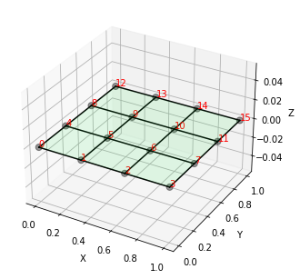
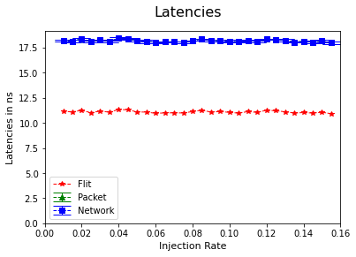

# Tutorial 1

Welcome to the tutorial 1 of the ratatoskr-tools. In this section, you will get the general idea of how the simulation workflow of ratatoskr is.

## Prerequisite

Before this tutorial, it is required to compile and retrieve the execution simulator program "./sim" from the ratatoskr/simulator repository. Here, we set the simulator path as shown:

```python
SIM_PATH = "../ratatoskr/simulator/sim"
```

## Network configuration

Let's start with the network configuration. First, we create a config.ini file, which is a file to make up your simulation settings. In default, you will do a 4x4 Mesh simulation. You can change the settings in the config.ini file yourself freely.The config.ini cntains the parameters for software and hardware models. Software model section includes the Config and Network parameters along with a section that configures multiple simulations of synthetic data send uniformly. Hardware model configurations generate the VHDL code and templates and it has router parameters and algorithm.

Here, we create the config.ini file in the directory ./tutorials/example/. The function "create_config_ini()" will copy all the contents from the source config.ini file to the specified destination provided.

'''python
import ratatoskr_tools.networkconfig as rtcfg

rtcfg.create_config_ini("./tutorials/example/config.ini")
'''

After the config.ini file has been created, we need to convert it into the format ("config.xml" and "network.xml") which the simulator can accept for the simulations.
- "config.xml" file contains the general information for the simulator, such as the injection rate of the flits, simulation time, etc.
- "network.xml" file contains the information regarding the connections between each router in the NoC.

The configuration settings can be stored in the variable "config" which will be used later on. "create_configuration()" uses the xml writers to get the config and network xml files written.  

'''python
config = rtcfg.create_configuration("./example/config.ini", "./example/config.xml", "./example/network.xml")
'''

## Network plot
After the configuration, you can see the connection of your NoC through the following function. Through different given arguments, you can output the connection image into a file or let it shows during the program (it is recommended to set plt_show to False during automation).

The generated image is stored in the variable "fig_network" which will be used later on.The function "plot_static()" takes the given config and the network xml files as the input for generating the network plot. plt_show is set as False by default and if the plot is to be displayed on UI its been passed as True.


```python
import ratatoskr_tools.networkplot as rtnplt

fig_network = rtnplt.plot_static("./tutorials/example/network.xml", "./tutorials/example/config.ini", plt_show=True)
```


    

    


## Simulation & Data handle

During the simulation, 3 kinds of data will be generated, which are VC usages, Buff usages and latencies (flit, packet, network). So, we need to give an initialization for each variable to handle multiple simulations:


```python
import numpy as np

# initialization of variables
vc_usages = []
buff_usages = []
inj_rates = np.arange(config.runRateMin, config.runRateMax, config.runRateStep).round(4)
lats_flit = -np.ones((len(inj_rates), config.restarts))
lats_packet = -np.ones((len(inj_rates), config.restarts))
lats_network = -np.ones((len(inj_rates), config.restarts))
```

Then, we can start the simulation and let's import the module for it:


```python
import ratatoskr_tools.simulation as rtsim
import ratatoskr_tools.datahandle as rtdat
```

Before the simulation, it is recommended to clean the dummy directories that maybe present in the cureent folder used to ensure that it is clean. The function "remove_all_simdirs" does that removal for the passed folder location and the count of simulations. 


```python
rtsim.remove_all_simdirs("./tutorials/example/", config.restarts)
```

Then, we can start to simulate according to different injection rates. If you still haven't done the prerequisite (compile and retrieve the ./sim, please get it from the ratatoskr repository. Otherwise, you would not be able to continue this section).

Within the loop, we will first create the dummy simulation directories for repetitive simulation with same injection rate. (Here, the config.ini restarts default is 4 times). The function "rtsim.make_all_simdirs()" does the creation of the dummy directories based on the given restarts count in the specified directory. The function "edit_config_file()" edits the imjection rate of the config.xml and creates the destination file config_tmp.xml.

Then, we run the simulation parallely to speed up the simulation. The function "run_parallel_multiple_sims()" is provided with the created sim# folders, the path where the .sim file, config.xml and the network.xml files exists. 

After all simulations with same injection rate are completed, we can retrieve the simulation results which are stored in "simdirs". We get the VC usages, buffer usuages, latencies for flits, packets and network and finally reports are generated in the folder example under the "sim#" folders where each sim folder has unique number.

At the end of each loop, the dummy simulation directories are removed to make sure the data in next cycle of loop will not overlapped. (Notes: You can make more dummy directories for different injection rates too, given here is just a simple workflow :D).


```python
for idx, inj_rate in enumerate(inj_rates):

    simdirs = rtsim.make_all_simdirs("./tutorials/example/", config.restarts)

    rtcfg.edit_config_file(config, "./tutorials/example/config.xml", "./tutorials/example/config_tmp.xml", inj_rate)

    rtsim.run_parallel_multiple_sims(simdirs, SIM_PATH, "./tutorials/example/config.xml", "./tutorials/example/network.xml")

    vc_usages.append(rtdat.retrieve_vc_usages(simdirs, config))
    buff_usages.append(rtdat.retrieve_buff_usages(simdirs, config))
    lats_flit[idx], lats_packet[idx], lats_network[idx] = rtdat.retrieve_diff_latencies(simdirs)

    rtsim.remove_all_simdirs("./tutorials/example/", config.restarts)
```

## Data plot

After all simulation results are retrieved, we create plots and see the results of the simulation.

Here is the plot for latencies. The function "plot_latencies()" creates the plot for the provided dictionary of objects of injection rates and the latencies for flit, packet and network obtained from the simulation. The obtained figure can be saved in a file if the output_file parameter is passed to the function.


```python
import ratatoskr_tools.dataplot as rtdplt

fig_latencies = rtdplt.plot_latencies(inj_rates, lats_flit, lats_packet, lats_network, plt_show=True)
```


    

    


The plotting for vc usages and buff usages for the different injection rates are a lot, so we will first store it in the list without showing it.


```python
%matplotlib agg
figs_vc = rtdplt.plot_vc_usage_stats(vc_usages, inj_rates)
figs_buff = rtdplt.plot_buff_usage_stats(buff_usages, inj_rates)
```

## End

To output all plotted images, it is recommended to do it in the following way:


```python
import os
from matplotlib.backends.backend_pdf import PdfPages

figs = [fig_network, fig_latencies]
figs.extend(figs_vc)
figs.extend(figs_buff)

pdf = PdfPages(os.path.join("./tutorials/example/", "result.pdf"))
for fig in figs:
    pdf.savefig(fig)
pdf.close()
```
