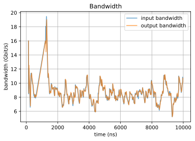

# Tutorial 3: Bandwidth of single simulation

In this tutorial, the plotting of in/output bandwidth of the NoC is demonstrated.

## Prerequisite

Before this tutorial, it is required to compile and retrieve the execution simulator program "./sim" from the ratatoskr/simulator repository. 
Let's compile the simulator:
```console
$ cd ../ratatoskr/simulator
$ cmake
$ make
$ cd ../tutorials
```

Here, we set the simulator path as shown:


```python
SIM_PATH = "../ratatoskr/simulator/sim"
```

# Step 1 Network Configuration
Create the config.ini file and generate the config.xml and network.xml files.


```python
import ratatoskr_tools.networkconfig as rtcfg

rtcfg.create_config_ini("./example/config.ini")
config = rtcfg.create_configuration("./example/config.ini", "./example/config.xml", "./example/network.xml")
```

# Step 2 Run the simulation
This time, we only run the simulation once and make the results are stored in the output directory
> "./example/"


```python
import ratatoskr_tools.simulation as rtsim

rtsim.run_single_sim(SIM_PATH, "./example/config.xml", "./example/network.xml", "./example")
```

# Step 3 Retrieve the bandwidth data
Then, we can retrieve the bandwidth data. You just need to give the output directory to the provided API, then the API will find the report in the given directory.

The bandwidth data are stored in
> "./report_Bandwidth_Input.csv" and "./report_Bandwidth_Output.csv"

respectively.

The interval of the bandwidth is set to 500ns.


```python
import ratatoskr_tools.datahandle as rtdat

inout_bw = rtdat.retrieve_inoutput_bandwidth("./example", interval=500)
```

# Step 4 Plot the bandwidth data


```python
import ratatoskr_tools.dataplot as rtdplt

fig = rtdplt.plot_bandwidth(*inout_bw, plt_show=True)
```


    

    


```python

```
